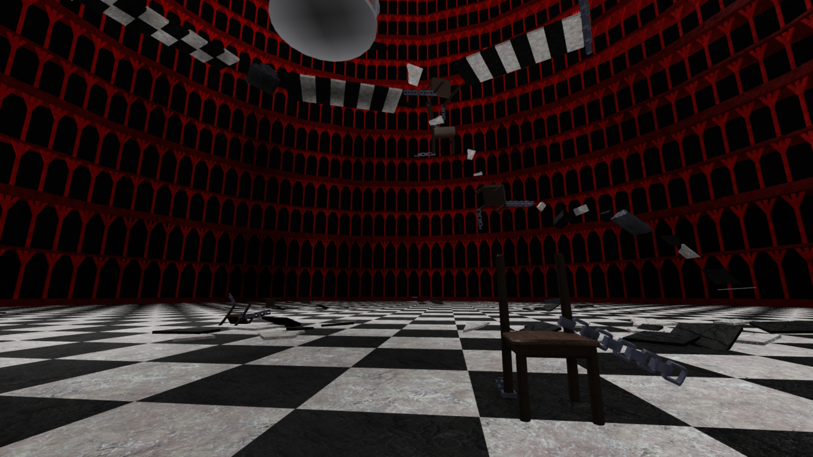
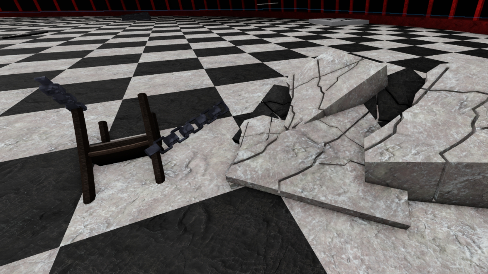
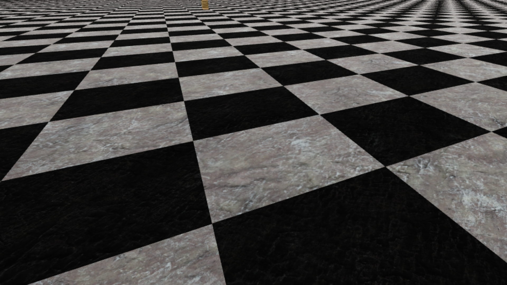
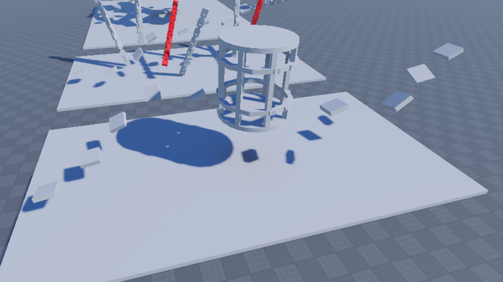
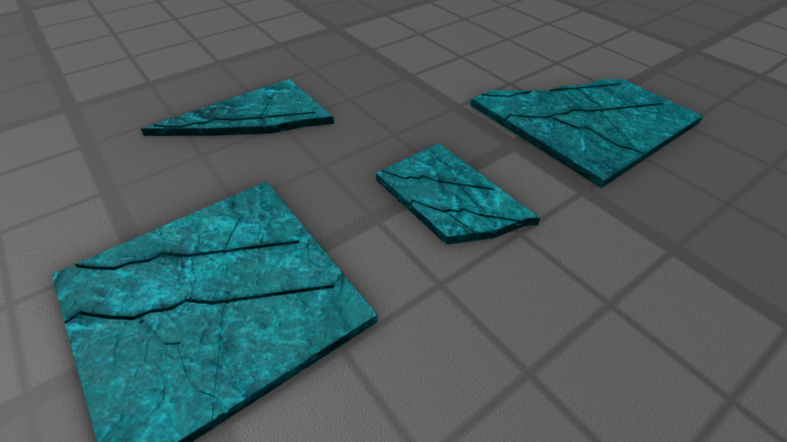

# rObby: Anime Obstacle Course Platformer 👺
**Lead Builder & Level Designer | Roblox Studio**

An immersive obstacle course (Obby) based on the *Tokyo Ghoul* aesthetic. This project features high-stakes platforming mechanics, custom-designed hazards, and a high-contrast environment designed to test player precision and flow.

---

## 📸 Project Gallery
Below are highlights of the level design and custom hazards.

| Sector | Technical Highlight |
| :--- | :--- |
|  | **Level Flow:** Strategic platform placement designed for a progressive difficulty curve. |
|  | **Themed Obstacles:** Custom "Kagune" kill-bricks that integrate anime motifs into gameplay. |
|  | **Visual Identity:** High-contrast red and black palette to drive player focus and urgency. |

<b>📂 Click to view full level tour (Extra shots)</b>

### Environmental Details
* 
* 

### Mechanics & Hazards
* 
* 

---

## 🛠️ Technical Specifications
* **Engine:** Roblox Studio
* **Focus:** Level Design, Difficulty Balancing, and UX (Player Pathing).
* **Assets:** Custom modular rubble, industrial chains, and emissive hazard geometry.

## 📂 Repository Structure
* `source/`: Contains the primary `.rbxl` project file.
* `documentation/`: High-resolution screenshots of level segments and mechanics.
