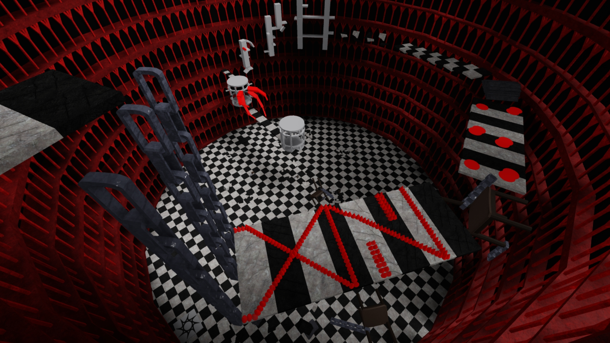
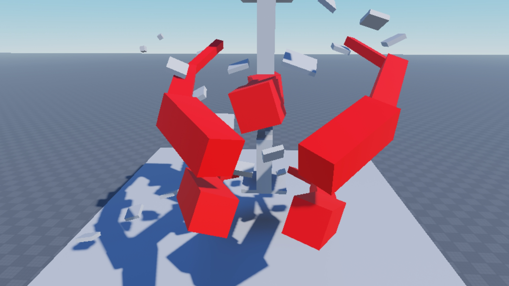

# rObby: Anime Obstacle Course Platformer 👺
**Lead Builder & Level Designer | Roblox Studio**

An anime-inspired obstacle course (Obby) based on *Tokyo Ghoul*. This project features high-stakes platforming mechanics, custom-coded hazards, and an immersive, dark-aesthetic environment designed to test player precision.

---

## 📸 Gameplay & Level Design
The level uses a high-contrast red and black color palette to create a sense of urgency and danger.

*Strategic placement of platforms to ensure a progressive difficulty curve.*

*Custom-designed "Kagune" inspired kill-bricks that act as primary environmental hazards.*

---

## 🕹️ Gameplay Mechanics
* **Precision Platforming:** Designed tight jump sequences and moving platforms to challenge veteran players.
* **Themed Hazards:** Integrated "Kill Bricks" into the environmental storytelling, using anime-specific motifs.
* **Modular Environment:** Built a library of broken concrete and checkerboard assets to ensure visual consistency across the map.

## 🛠️ Technical Specifications
- **Engine:** Roblox Studio
- **Focus:** Level Design, UX (Player Flow), Difficulty Balancing.
- **Assets:** Custom modular rubble, chains, and hazard geometry.

## 📂 Repository Structure
- `source/`: Contains the `.rbxl` project file.
- `documentation/`: High-resolution screenshots of level segments and mechanics.
